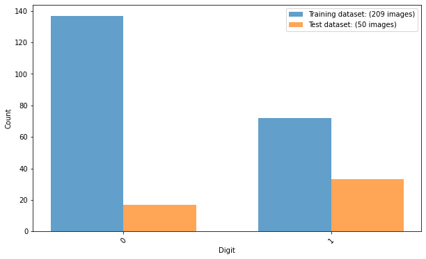
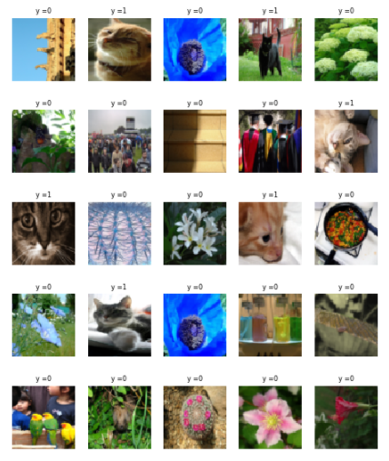
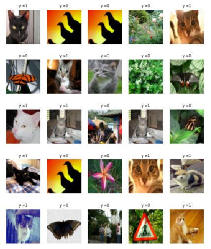
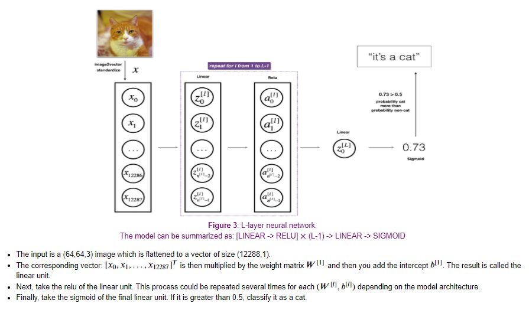
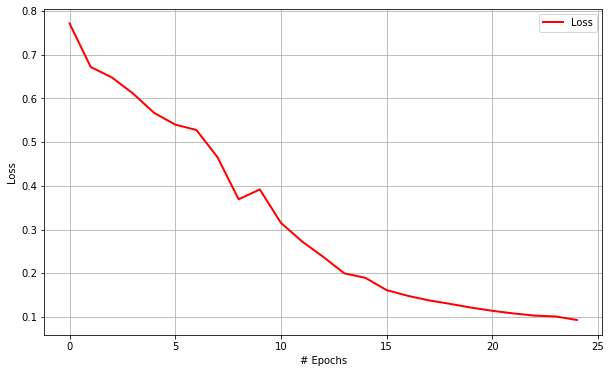
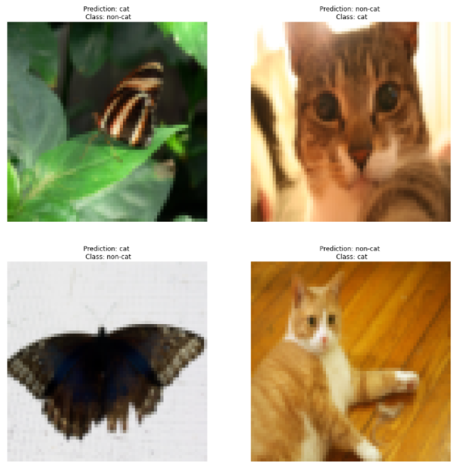
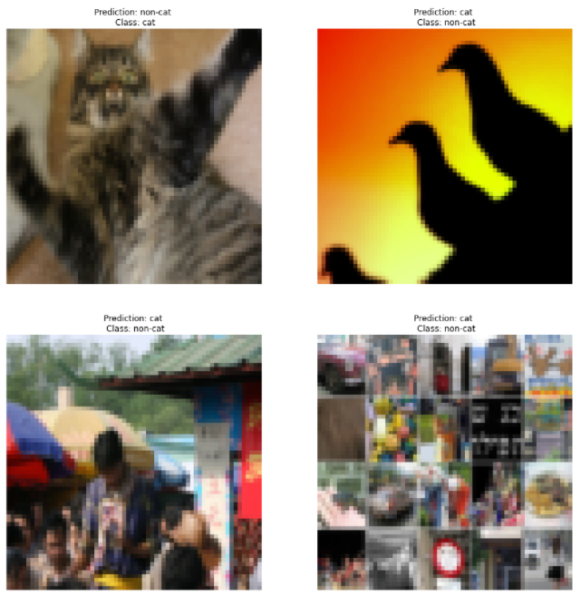
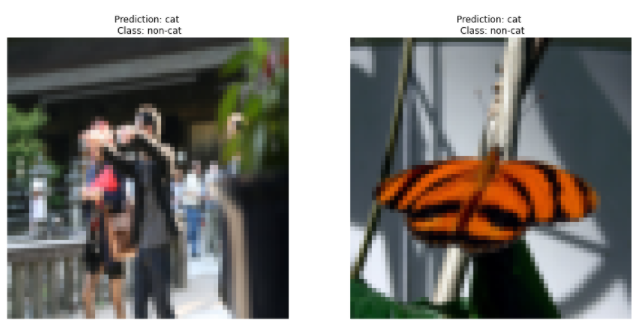
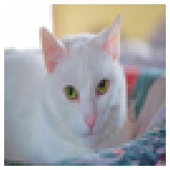

# Step-by-Step Implementation of Artificial Neural Networks (ANN) from Scratch for Binary Classification in Python

  
## 1. Objective

The objective of this project is to demonstrate the step-by-step implementation of an Artificial Neural Network (ANN) from scratch to classify images of cats.

## 2. Motivation

It is often said that “What I cannot build, I do not understand”. Thus, in order to gain a deeper understanding of Artificial Neural Networks (ANN), I embarked on this project with the aim to built an ANN, step-by-step and from scratch in NumPy, without making use of any Deep Learning frameworks such as Tensorflow, Keras, etc. 

* Implementing an ANN from scratch is complex process, but it can be broken down to iterating over the following steps:

  * Initializing the parameters for a two-layer network and for an 𝐿L-layer neural network
  * Implementing the forward propagation module (shown in purple in the figure below)
  * Computing the loss
  * Implementing the backward propagation module (denoted in red in the figure below)
  * Updating the parameters

We shall illustrate the step-by-step implementation of these two main phases and break them down into several functionalities. We shall use a small cat vs. non-cat data set as the basis for learning and practicing how to develop, evaluate, and use artificial neural networks for image classification from scratch. 

## 3. Data

* We will be using a small "Cat vs non-Cat" dataset, which consists of the following:
  * A training set of 209 images labelled as cat (1) or non-cat (0)
  * A test set of 50 images labelled as cat and non-cat
  * Each image is of shape (64, 64, 3).
  
## 4. Development

In this section, we shall demonstrate how to develop an Artificial  Neural Network (CNN) for binary image classification from scratch, without making use of any Deep Learning frameworks such as Tensorflow, Keras, etc. 

* The development process involves:

  * Reading and pre-processing the training and test data
  * Exploring and visualizing the training and test data:
  * Building the forward phase and backward phase of the ANN model
  * Training the built ANN model
  * Evaluating the performance of the trained ANN model.

  * Author: Mohsen Ghazel (mghazel)
  * Date: May 15th, 2021

  * Project: Step-by-Step Implementation Artificial Neural Networks (ANN) from Scratch using Numpy.

* To build your neural network, we will be implementing several utilities functions, as follows:
    * Initialize the parameters for a two-layer network and for an 𝐿L-layer neural network
    * Implement the forward propagation module
    * Compute the loss
    * Implement the backward propagation module
    * Finally, update the parameters.

This development process is illustrated in the figure below.

* First, we make the following observations:

  * For every forward function, there is a corresponding backward function.
  * This is why at every step of your forward module you will be storing some values in a cache. 
  * These cached values are useful for computing gradients.
  * In the backpropagation module, you can then use the cache to calculate the gradients.

### 4.1. Step 1: Imports and global variables:

#### 4.1.1. Standard scientific Python imports:

<pre style="color:#000020;background:#e6ffff;font-size:10px;line-height:1.5;">import time
import numpy as np
import h5py
import matplotlib.pyplot as plt
import scipy
from PIL import Image
from scipy import ndimage

# random number generators values
# seed for reproducing the random number generation
from random import seed
# random integers: I(0,M)
from random import randint
# random standard unform: U(0,1)
from random import random
# time
import datetime
# I/O
import os
# sys
import sys

%matplotlib inline
plt.rcParams['figure.figsize'] = (5.0, 4.0) # set default size of plots
plt.rcParams['image.interpolation'] = 'nearest'
plt.rcParams['image.cmap'] = 'gray'
</pre>

### 4.1.2. Global variables:

<pre style="color:#000020;background:#e6ffff;font-size:10px;line-height:1.5;">#-------------------------------------------------------------------------------
# Set the random state to 101
#-------------------------------------------------------------------------------
# - This ensures repeatable results everytime you run the code. 
RANDOM_STATE = 101

#-------------------------------------------------------------------------------
# We set the Numpy pseudo-random generator at a fixed value:
#-------------------------------------------------------------------------------
# - This ensures repeatable results everytime you run the code. 
np.random.seed(RANDOM_STATE)

# the number of visualized images
NUM_VISUALIZED_IMAGES = 25
</pre>

### 4.2. Step 2: Load and process the dataset:

* We will be using a small "Cat vs non-Cat" dataset, which consists of the following:
  * A training set of 209 images labelled as cat (1) or non-cat (0)
  * A test set of 50 images labelled as cat and non-cat
  * Each image is of shape (64, 64, 3)
  * Let's get more familiar with the dataset. Load the data by running the cell below.
  
#### 4.2.1. Implement functionality to load the dataset:

<pre style="color:#000020;background:#e6ffff;font-size:10px;line-height:1.5;">def load_data():
    """
&nbsp;&nbsp;&nbsp;&nbsp;Load the the dataseta nd split it into training and test subsets.
&nbsp;&nbsp;&nbsp;&nbsp;"""
    train_dataset = h5py.File('datasets/train_catvnoncat.h5', "r")
    train_set_x_orig = np.array(train_dataset["train_set_x"][:]) # your train set features
    train_set_y_orig = np.array(train_dataset["train_set_y"][:]) # your train set labels

    test_dataset = h5py.File('datasets/test_catvnoncat.h5', "r")
    test_set_x_orig = np.array(test_dataset["test_set_x"][:]) # your test set features
    test_set_y_orig = np.array(test_dataset["test_set_y"][:]) # your test set labels

    classes = np.array(test_dataset["list_classes"][:]) # the list of classes
    
    train_set_y_orig = train_set_y_orig.reshape((1, train_set_y_orig.shape[0]))
    test_set_y_orig = test_set_y_orig.reshape((1, test_set_y_orig.shape[0]))
    
    return train_set_x_orig, train_set_y_orig, test_set_x_orig, test_set_y_orig, classes
</pre>

#### 4.2.2. Load the training and test subsets:

<pre style="color:#000020;background:#e6ffff;font-size:10px;line-height:1.5;"># load the traininga nd test data subsets
train_x_orig, train_y, test_x_orig, test_y, classes = load_data()
</pre>

#### 4.2.3. Display the number and shape of the training and test subsets:

<pre style="color:#000020;background:#e6ffff;font-size:10px;line-height:1.5;">#------------------------------------------------------
# # Explore your dataset:
#------------------------------------------------------
# the number of training examples
m_train = train_x_orig.shape[0]
# the number of image pixels
num_px = train_x_orig.shape[1]
# the number of test examples
m_test = test_x_orig.shape[0]
# display dataset properties
print ("Number of training examples: " + str(m_train))
print ("Number of testing examples: " + str(m_test))
print ("Each image is of size: (" + str(num_px) + ", " + str(num_px) + ", 3)")
print ("train_x_orig shape: " + str(train_x_orig.shape))
print ("train_y shape: " + str(train_y.shape))
print ("test_x_orig shape: " + str(test_x_orig.shape))
print ("test_y shape: " + str(test_y.shape))

Number of training examples: 209
Number of testing examples: 50
Each image is of size: (64, 64, 3)
train_x_orig shape: (209, 64, 64, 3)
train_y shape: (1, 209)
test_x_orig shape: (50, 64, 64, 3)
test_y shape: (1, 50)
</pre>

#### 4.2.4. Display the targets/classes:

* We expect 2 classes:
  * 1: Cat
  * 0: Not-Cat

<pre style="color:#000020;background:#e6ffff;font-size:10px;line-height:1.5;">print("----------------------------------------------")
print("Classes/labels:")
print("----------------------------------------------")
print('The target labels: ' + str(np.unique(train_y)))
print("----------------------------------------------")

----------------------------------------------
Classes/labels:
----------------------------------------------
The target labels: [0 1]
----------------------------------------------
</pre>

#### 4.2.5. Examine the number of images for each class of the training and testing subsets:

##### 4.2.5.1 First implement a functionality to generate the histogram of the number of training and test images:

<pre style="color:#000020;background:#e6ffff;font-size:10px;line-height:1.5;"># create a histogram of the number of images in each class/digit:
def plot_bar(y, loc='left', relative=False):
    width = 0.35
    if loc == 'left':
        n = -0.5
    elif loc == 'right':
        n = 0.5
     
    # calculate counts per type and sort, to ensure their order
    unique, counts = np.unique(y, return_counts=True)
    sorted_index = np.argsort(unique)
    unique = unique[sorted_index]
     
    if relative:
        # plot as a percentage
        counts = 100*counts[sorted_index]/len(y)
        ylabel_text = '% Count'
    else:
        # plot counts
        counts = counts[sorted_index]
        ylabel_text = 'Count'
         
    xtemp = np.arange(len(unique))
    plt.bar(xtemp + n*width, counts, align='center', alpha=.7, width=width)
    plt.xticks(xtemp, unique, rotation=45)
    plt.xlabel('Digit')
    plt.ylabel(ylabel_text)
# add title
plt.suptitle('Percentage of images per digit (0-9)')
plt.show()
</pre>

##### 4.2.5.2. Call the functionality to generate the histogram of the number of training and test images:

<pre style="color:#000020;background:#e6ffff;font-size:10px;line-height:1.5;">#----------------------------------------------------
# Call the function to create the histograms of the 
# training and test images:
#----------------------------------------------------
# set the figure size
plt.figure(figsize=(10, 6))
# training data histogram
plot_bar(train_y.reshape(train_y.shape[1],1), loc='left')
# test data histogram
plot_bar(test_y.reshape(test_y.shape[1],1), loc='right')
# legend
plt.legend([
    'Training dataset: ({0} images)'.format(len(train_y.reshape(train_y.shape[1],1))), 
    'Test dataset: ({0} images)'.format(len(test_y.reshape(test_y.shape[1],1))), 
])
plt.show()
</pre>

#### 4.2.6 Visualize some of the training and test images and their associated targets:
##### 4.2.6.1. First implement a visualization functionality to visualize the number of randomly selected images:

<pre style="color:#000020;background:#e6ffff;font-size:10px;line-height:1.5;">"""
# A utility function to visualize multiple images:
"""
def visualize_images_and_labels(num_visualized_images = 25, dataset_flag = 1):
  """To visualize images.

&nbsp;&nbsp;&nbsp;&nbsp;&nbsp;&nbsp;Keyword arguments:
&nbsp;&nbsp;&nbsp;&nbsp;&nbsp;&nbsp;&nbsp;&nbsp;&nbsp;- num_visualized_images -- the number of visualized images (deafult 25)
&nbsp;&nbsp;&nbsp;&nbsp;&nbsp;&nbsp;&nbsp;&nbsp;&nbsp;- dataset_flag -- 1: training dataset, 2: test dataset
&nbsp;&nbsp;&nbsp;&nbsp;&nbsp;&nbsp;Return:
&nbsp;&nbsp;&nbsp;&nbsp;&nbsp;&nbsp;&nbsp;&nbsp;&nbsp;- None
&nbsp;&nbsp;"""
  #--------------------------------------------
  # the suplot grid shape:
  #--------------------------------------------
  num_rows = 5
  # the number of columns
  num_cols = num_visualized_images // num_rows
  # setup the subplots axes
  fig, axes = plt.subplots(nrows=num_rows, ncols=num_cols, figsize=(8, 10))
  # set a seed random number generator for reproducible results
  seed(RANDOM_STATE)
  # iterate over the sub-plots
  for row in range(num_rows):
      for col in range(num_cols):
        # get the next figure axis
        ax = axes[row, col];
        # turn-off subplot axis
        ax.set_axis_off()
        #--------------------------------------------
        # if the dataset_flag = 1: Training data set
        #--------------------------------------------
        if ( dataset_flag == 1 ): 
          # generate a random image counter
          counter = randint(0,m_train)
          # get the training image
          image = np.squeeze(train_x_orig[counter,:])
          # get the target associated with the image
          label = train_y[0, counter]
        #--------------------------------------------
        # dataset_flag = 2: Test data set
        #--------------------------------------------
        else: 
          # generate a random image counter
          counter = randint(0,m_test)
          # get the test image
          image = np.squeeze(test_x_orig[counter,:])
          # get the target associated with the image
          label = test_y[0, counter]
        #--------------------------------------------
        # display the image
        #--------------------------------------------
        ax.imshow(image, cmap=plt.cm.gray_r, interpolation='nearest')
        # set the title showing the image label
        ax.set_title('y =' + str(label), size = 8)
</pre>

##### 4.2.6.2. Visualize some of the training images and their associated targets:

##### 4.2.6.3. Visualize some of the test images and their associated targets:

#### 4.2.7. Reshape and Normalize the training and test images:
* We need to reshape and standardize the images before feeding them to the network:

##### 4.2.7.1. Flatten the 2D images to 1D vectors:

<pre style="color:#000020;background:#e6ffff;font-size:10px;line-height:1.5;"># Reshape the training and test examples 
# The "-1" makes reshape flatten the remaining dimensions
train_x_flatten = train_x_orig.reshape(train_x_orig.shape[0], -1).T   
# The "-1" makes reshape flatten the remaining dimensions
test_x_flatten = test_x_orig.reshape(test_x_orig.shape[0], -1).T)
</pre>

##### 4.2.7.2) Normalize the training and test images to the (0,1) range:

<pre style="color:#000020;background:#e6ffff;font-size:10px;line-height:1.5;"># Standardize data to have feature values between 0 and 1.
train_x = train_x_flatten/255.
test_x = test_x_flatten/255.

print ("train_x's shape: " + str(train_x.shape))
print ("test_x's shape: " + str(test_x.shape))

train_x's shape: (12288, 209)
test_x's shape: (12288, 50)
</pre>

### 4.3. Step 3: Build the Artificial Neural Network Model Architecture:

#### 4.3.1. The L-layer Deep Neural Network:

* The L-layer deep neural network has the following simplified network representation:

#### 4.3.2. General Methodology:

* As usual, you'll follow the Deep Learning methodology to build the model:

  * Initialize parameters / Define hyperparameters
  * Loop for num_iterations: a. Forward propagation b. Compute cost function c. Backward propagation d. Update parameters (using parameters, and grads from backprop)
  * Use trained parameters to predict labels
  * Now go ahead and implement the L-layer ANN model.
  
#### 4.3.3 Utilities functions:

##### 4.3.3.1. Functions to initialize parameters and define hyperparameters:

<pre style="color:#000020;background:#e6ffff;font-size:10px;line-height:1.5;">def initialize_parameters(n_x, n_h, n_y):
    """
&nbsp;&nbsp;&nbsp;&nbsp;Argument:
&nbsp;&nbsp;&nbsp;&nbsp;n_x -- size of the input layer
&nbsp;&nbsp;&nbsp;&nbsp;n_h -- size of the hidden layer
&nbsp;&nbsp;&nbsp;&nbsp;n_y -- size of the output layer
&nbsp;&nbsp;&nbsp;&nbsp;
&nbsp;&nbsp;&nbsp;&nbsp;Returns:
&nbsp;&nbsp;&nbsp;&nbsp;parameters -- python dictionary containing your parameters:
&nbsp;&nbsp;&nbsp;&nbsp;&nbsp;&nbsp;&nbsp;&nbsp;&nbsp;&nbsp;&nbsp;&nbsp;&nbsp;&nbsp;&nbsp;&nbsp;&nbsp;&nbsp;&nbsp;&nbsp;W1 -- weight matrix of shape (n_h, n_x)
&nbsp;&nbsp;&nbsp;&nbsp;&nbsp;&nbsp;&nbsp;&nbsp;&nbsp;&nbsp;&nbsp;&nbsp;&nbsp;&nbsp;&nbsp;&nbsp;&nbsp;&nbsp;&nbsp;&nbsp;b1 -- bias vector of shape (n_h, 1)
&nbsp;&nbsp;&nbsp;&nbsp;&nbsp;&nbsp;&nbsp;&nbsp;&nbsp;&nbsp;&nbsp;&nbsp;&nbsp;&nbsp;&nbsp;&nbsp;&nbsp;&nbsp;&nbsp;&nbsp;W2 -- weight matrix of shape (n_y, n_h)
&nbsp;&nbsp;&nbsp;&nbsp;&nbsp;&nbsp;&nbsp;&nbsp;&nbsp;&nbsp;&nbsp;&nbsp;&nbsp;&nbsp;&nbsp;&nbsp;&nbsp;&nbsp;&nbsp;&nbsp;b2 -- bias vector of shape (n_y, 1)
&nbsp;&nbsp;&nbsp;&nbsp;"""
    
    np.random.seed(1)
    
    W1 = np.random.randn(n_h, n_x)*0.01
    b1 = np.zeros((n_h, 1))
    W2 = np.random.randn(n_y, n_h)*0.01
    b2 = np.zeros((n_y, 1))
    
    assert(W1.shape == (n_h, n_x))
    assert(b1.shape == (n_h, 1))
    assert(W2.shape == (n_y, n_h))
    assert(b2.shape == (n_y, 1))
    
    parameters = {"W1": W1,
                  "b1": b1,
                  "W2": W2,
                  "b2": b2}
    
    return parameters     

def initialize_parameters_deep(layer_dims):
    """
&nbsp;&nbsp;&nbsp;&nbsp;Arguments:
&nbsp;&nbsp;&nbsp;&nbsp;layer_dims -- python array (list) containing the dimensions of each layer in our network
&nbsp;&nbsp;&nbsp;&nbsp;
&nbsp;&nbsp;&nbsp;&nbsp;Returns:
&nbsp;&nbsp;&nbsp;&nbsp;parameters -- python dictionary containing your parameters "W1", "b1", ..., "WL", "bL":
&nbsp;&nbsp;&nbsp;&nbsp;&nbsp;&nbsp;&nbsp;&nbsp;&nbsp;&nbsp;&nbsp;&nbsp;&nbsp;&nbsp;&nbsp;&nbsp;&nbsp;&nbsp;&nbsp;&nbsp;Wl -- weight matrix of shape (layer_dims[l], layer_dims[l-1])
&nbsp;&nbsp;&nbsp;&nbsp;&nbsp;&nbsp;&nbsp;&nbsp;&nbsp;&nbsp;&nbsp;&nbsp;&nbsp;&nbsp;&nbsp;&nbsp;&nbsp;&nbsp;&nbsp;&nbsp;bl -- bias vector of shape (layer_dims[l], 1)
&nbsp;&nbsp;&nbsp;&nbsp;"""
    
    np.random.seed(1)
    parameters = {}
    L = len(layer_dims)            # number of layers in the network

    for l in range(1, L):
        parameters['W' + str(l)] = np.random.randn(layer_dims[l], layer_dims[l-1]) / np.sqrt(layer_dims[l-1]) #*0.01
        parameters['b' + str(l)] = np.zeros((layer_dims[l], 1))
        
        assert(parameters['W' + str(l)].shape == (layer_dims[l], layer_dims[l-1]))
        assert(parameters['b' + str(l)].shape == (layer_dims[l], 1))

        
    return parameters
</pre>

#### 4.3.3.2. Functions to implement the Forward Propagation:

<pre style="color:#000020;background:#e6ffff;font-size:10px;line-height:1.5;">def sigmoid(Z):
    """
&nbsp;&nbsp;&nbsp;&nbsp;Implements the sigmoid activation in numpy
&nbsp;&nbsp;&nbsp;&nbsp;
&nbsp;&nbsp;&nbsp;&nbsp;Arguments:
&nbsp;&nbsp;&nbsp;&nbsp;Z -- numpy array of any shape
&nbsp;&nbsp;&nbsp;&nbsp;
&nbsp;&nbsp;&nbsp;&nbsp;Returns:
&nbsp;&nbsp;&nbsp;&nbsp;A -- output of sigmoid(z), same shape as Z
&nbsp;&nbsp;&nbsp;&nbsp;cache -- returns Z as well, useful during backpropagation
&nbsp;&nbsp;&nbsp;&nbsp;"""
    
    A = 1/(1+np.exp(-Z))
    cache = Z
    
    return A, cache

def relu(Z):
    """
&nbsp;&nbsp;&nbsp;&nbsp;Implement the RELU function.

&nbsp;&nbsp;&nbsp;&nbsp;Arguments:
&nbsp;&nbsp;&nbsp;&nbsp;Z -- Output of the linear layer, of any shape

&nbsp;&nbsp;&nbsp;&nbsp;Returns:
&nbsp;&nbsp;&nbsp;&nbsp;A -- Post-activation parameter, of the same shape as Z
&nbsp;&nbsp;&nbsp;&nbsp;cache -- a python dictionary containing "A" ; stored for computing the backward pass efficiently
&nbsp;&nbsp;&nbsp;&nbsp;"""
    
    A = np.maximum(0,Z)
    
    assert(A.shape == Z.shape)
    
    cache = Z 
    return A, cache

def linear_forward(A, W, b):
    """
&nbsp;&nbsp;&nbsp;&nbsp;Implement the linear part of a layer's forward propagation.

&nbsp;&nbsp;&nbsp;&nbsp;Arguments:
&nbsp;&nbsp;&nbsp;&nbsp;A -- activations from previous layer (or input data): (size of previous layer, number of examples)
&nbsp;&nbsp;&nbsp;&nbsp;W -- weights matrix: numpy array of shape (size of current layer, size of previous layer)
&nbsp;&nbsp;&nbsp;&nbsp;b -- bias vector, numpy array of shape (size of the current layer, 1)

&nbsp;&nbsp;&nbsp;&nbsp;Returns:
&nbsp;&nbsp;&nbsp;&nbsp;Z -- the input of the activation function, also called pre-activation parameter 
&nbsp;&nbsp;&nbsp;&nbsp;cache -- a python dictionary containing "A", "W" and "b" ; stored for computing the backward pass efficiently
&nbsp;&nbsp;&nbsp;&nbsp;"""
    
    Z = W.dot(A) + b
    
    assert(Z.shape == (W.shape[0], A.shape[1]))
    cache = (A, W, b)
    
    return Z, cache

def linear_activation_forward(A_prev, W, b, activation):
    """
&nbsp;&nbsp;&nbsp;&nbsp;Implement the forward propagation for the LINEAR-&gt;ACTIVATION layer

&nbsp;&nbsp;&nbsp;&nbsp;Arguments:
&nbsp;&nbsp;&nbsp;&nbsp;A_prev -- activations from previous layer (or input data): (size of previous layer, number of examples)
&nbsp;&nbsp;&nbsp;&nbsp;W -- weights matrix: numpy array of shape (size of current layer, size of previous layer)
&nbsp;&nbsp;&nbsp;&nbsp;b -- bias vector, numpy array of shape (size of the current layer, 1)
&nbsp;&nbsp;&nbsp;&nbsp;activation -- the activation to be used in this layer, stored as a text string: "sigmoid" or "relu"

&nbsp;&nbsp;&nbsp;&nbsp;Returns:
&nbsp;&nbsp;&nbsp;&nbsp;A -- the output of the activation function, also called the post-activation value 
&nbsp;&nbsp;&nbsp;&nbsp;cache -- a python dictionary containing "linear_cache" and "activation_cache";
&nbsp;&nbsp;&nbsp;&nbsp;&nbsp;&nbsp;&nbsp;&nbsp;&nbsp;&nbsp;&nbsp;&nbsp;&nbsp;stored for computing the backward pass efficiently
&nbsp;&nbsp;&nbsp;&nbsp;"""
    
    if activation == "sigmoid":
        # Inputs: "A_prev, W, b". Outputs: "A, activation_cache".
        Z, linear_cache = linear_forward(A_prev, W, b)
        A, activation_cache = sigmoid(Z)
    
    elif activation == "relu":
        # Inputs: "A_prev, W, b". Outputs: "A, activation_cache".
        Z, linear_cache = linear_forward(A_prev, W, b)
        A, activation_cache = relu(Z)
    
    assert (A.shape == (W.shape[0], A_prev.shape[1]))
    cache = (linear_cache, activation_cache)

    return A, cache

def L_model_forward(X, parameters):
    """
&nbsp;&nbsp;&nbsp;&nbsp;Implement forward propagation for the [LINEAR-&gt;RELU]*(L-1)-&gt;LINEAR-&gt;SIGMOID computation
&nbsp;&nbsp;&nbsp;&nbsp;
&nbsp;&nbsp;&nbsp;&nbsp;Arguments:
&nbsp;&nbsp;&nbsp;&nbsp;X -- data, numpy array of shape (input size, number of examples)
&nbsp;&nbsp;&nbsp;&nbsp;parameters -- output of initialize_parameters_deep()
&nbsp;&nbsp;&nbsp;&nbsp;
&nbsp;&nbsp;&nbsp;&nbsp;Returns:
&nbsp;&nbsp;&nbsp;&nbsp;AL -- last post-activation value
&nbsp;&nbsp;&nbsp;&nbsp;caches -- list of caches containing:
&nbsp;&nbsp;&nbsp;&nbsp;&nbsp;&nbsp;&nbsp;&nbsp;&nbsp;&nbsp;&nbsp;&nbsp;&nbsp;&nbsp;&nbsp;&nbsp;every cache of linear_relu_forward() (there are L-1 of them, indexed from 0 to L-2)
&nbsp;&nbsp;&nbsp;&nbsp;&nbsp;&nbsp;&nbsp;&nbsp;&nbsp;&nbsp;&nbsp;&nbsp;&nbsp;&nbsp;&nbsp;&nbsp;the cache of linear_sigmoid_forward() (there is one, indexed L-1)
&nbsp;&nbsp;&nbsp;&nbsp;"""

    caches = []
    A = X
    L = len(parameters) // 2                  # number of layers in the neural network
    
    # Implement [LINEAR -&gt; RELU]*(L-1). Add "cache" to the "caches" list.
    for l in range(1, L):
        A_prev = A 
        A, cache = linear_activation_forward(A_prev, parameters['W' + str(l)], parameters['b' + str(l)], activation = "relu")
        caches.append(cache)
    
    # Implement LINEAR -&gt; SIGMOID. Add "cache" to the "caches" list.
    AL, cache = linear_activation_forward(A, parameters['W' + str(L)], parameters['b' + str(L)], activation = "sigmoid")
    caches.append(cache)
    
    assert(AL.shape == (1,X.shape[1]))
            
    return AL, caches
</pre>

##### 4.3.3.3. Function to compute the cost:

<pre style="color:#000020;background:#e6ffff;font-size:10px;line-height:1.5;">def compute_cost(AL, Y):
    """
&nbsp;&nbsp;&nbsp;&nbsp;Implement the cost function defined by equation (7).

&nbsp;&nbsp;&nbsp;&nbsp;Arguments:
&nbsp;&nbsp;&nbsp;&nbsp;AL -- probability vector corresponding to your label predictions, shape (1, number of examples)
&nbsp;&nbsp;&nbsp;&nbsp;Y -- true "label" vector (for example: containing 0 if non-cat, 1 if cat), shape (1, number of examples)

&nbsp;&nbsp;&nbsp;&nbsp;Returns:
&nbsp;&nbsp;&nbsp;&nbsp;cost -- cross-entropy cost
&nbsp;&nbsp;&nbsp;&nbsp;"""
    
    m = Y.shape[1]

    # Compute loss from aL and y.
    cost = (1./m) * (-np.dot(Y,np.log(AL).T) - np.dot(1-Y, np.log(1-AL).T))
    
    cost = np.squeeze(cost)      # To make sure your cost's shape is what we expect (e.g. this turns [[17]] into 17).
    assert(cost.shape == ())
    
    return cost
</pre>

##### 4.3.3.4. Functions to implement the Backward propagation:

<pre style="color:#000020;background:#e6ffff;font-size:10px;line-height:1.5;">def relu_backward(dA, cache):
    """
&nbsp;&nbsp;&nbsp;&nbsp;Implement the backward propagation for a single RELU unit.

&nbsp;&nbsp;&nbsp;&nbsp;Arguments:
&nbsp;&nbsp;&nbsp;&nbsp;dA -- post-activation gradient, of any shape
&nbsp;&nbsp;&nbsp;&nbsp;cache -- 'Z' where we store for computing backward propagation efficiently

&nbsp;&nbsp;&nbsp;&nbsp;Returns:
&nbsp;&nbsp;&nbsp;&nbsp;dZ -- Gradient of the cost with respect to Z
&nbsp;&nbsp;&nbsp;&nbsp;"""
    
    Z = cache
    dZ = np.array(dA, copy=True) # just converting dz to a correct object.
    
    # When z &lt;= 0, you should set dz to 0 as well. 
    dZ[Z &lt;= 0] = 0
    
    assert (dZ.shape == Z.shape)
    
    return dZ

def sigmoid_backward(dA, cache):
    """
&nbsp;&nbsp;&nbsp;&nbsp;Implement the backward propagation for a single SIGMOID unit.

&nbsp;&nbsp;&nbsp;&nbsp;Arguments:
&nbsp;&nbsp;&nbsp;&nbsp;dA -- post-activation gradient, of any shape
&nbsp;&nbsp;&nbsp;&nbsp;cache -- 'Z' where we store for computing backward propagation efficiently

&nbsp;&nbsp;&nbsp;&nbsp;Returns:
&nbsp;&nbsp;&nbsp;&nbsp;dZ -- Gradient of the cost with respect to Z
&nbsp;&nbsp;&nbsp;&nbsp;"""
    
    Z = cache
    
    s = 1/(1+np.exp(-Z))
    dZ = dA * s * (1-s)
    
    assert (dZ.shape == Z.shape)
    
    return dZ

def linear_backward(dZ, cache):
    """
&nbsp;&nbsp;&nbsp;&nbsp;Implement the linear portion of backward propagation for a single layer (layer l)

&nbsp;&nbsp;&nbsp;&nbsp;Arguments:
&nbsp;&nbsp;&nbsp;&nbsp;dZ -- Gradient of the cost with respect to the linear output (of current layer l)
&nbsp;&nbsp;&nbsp;&nbsp;cache -- tuple of values (A_prev, W, b) coming from the forward propagation in the current layer

&nbsp;&nbsp;&nbsp;&nbsp;Returns:
&nbsp;&nbsp;&nbsp;&nbsp;dA_prev -- Gradient of the cost with respect to the activation (of the previous layer l-1), same shape as A_prev
&nbsp;&nbsp;&nbsp;&nbsp;dW -- Gradient of the cost with respect to W (current layer l), same shape as W
&nbsp;&nbsp;&nbsp;&nbsp;db -- Gradient of the cost with respect to b (current layer l), same shape as b
&nbsp;&nbsp;&nbsp;&nbsp;"""
    A_prev, W, b = cache
    m = A_prev.shape[1]

    dW = 1./m * np.dot(dZ,A_prev.T)
    db = 1./m * np.sum(dZ, axis = 1, keepdims = True)
    dA_prev = np.dot(W.T,dZ)
    
    assert (dA_prev.shape == A_prev.shape)
    assert (dW.shape == W.shape)
    assert (db.shape == b.shape)
    
    return dA_prev, dW, db

def linear_activation_backward(dA, cache, activation):
    """
&nbsp;&nbsp;&nbsp;&nbsp;Implement the backward propagation for the LINEAR-&gt;ACTIVATION layer.
&nbsp;&nbsp;&nbsp;&nbsp;
&nbsp;&nbsp;&nbsp;&nbsp;Arguments:
&nbsp;&nbsp;&nbsp;&nbsp;dA -- post-activation gradient for current layer l 
&nbsp;&nbsp;&nbsp;&nbsp;cache -- tuple of values (linear_cache, activation_cache) we store for computing backward propagation efficiently
&nbsp;&nbsp;&nbsp;&nbsp;activation -- the activation to be used in this layer, stored as a text string: "sigmoid" or "relu"
&nbsp;&nbsp;&nbsp;&nbsp;
&nbsp;&nbsp;&nbsp;&nbsp;Returns:
&nbsp;&nbsp;&nbsp;&nbsp;dA_prev -- Gradient of the cost with respect to the activation (of the previous layer l-1), same shape as A_prev
&nbsp;&nbsp;&nbsp;&nbsp;dW -- Gradient of the cost with respect to W (current layer l), same shape as W
&nbsp;&nbsp;&nbsp;&nbsp;db -- Gradient of the cost with respect to b (current layer l), same shape as b
&nbsp;&nbsp;&nbsp;&nbsp;"""
    linear_cache, activation_cache = cache
    
    if activation == "relu":
        dZ = relu_backward(dA, activation_cache)
        dA_prev, dW, db = linear_backward(dZ, linear_cache)
        
    elif activation == "sigmoid":
        dZ = sigmoid_backward(dA, activation_cache)
        dA_prev, dW, db = linear_backward(dZ, linear_cache)
    
    return dA_prev, dW, db

def L_model_backward(AL, Y, caches):
    """
&nbsp;&nbsp;&nbsp;&nbsp;Implement the backward propagation for the [LINEAR-&gt;RELU] * (L-1) -&gt; LINEAR -&gt; SIGMOID group
&nbsp;&nbsp;&nbsp;&nbsp;
&nbsp;&nbsp;&nbsp;&nbsp;Arguments:
&nbsp;&nbsp;&nbsp;&nbsp;AL -- probability vector, output of the forward propagation (L_model_forward())
&nbsp;&nbsp;&nbsp;&nbsp;Y -- true "label" vector (containing 0 if non-cat, 1 if cat)
&nbsp;&nbsp;&nbsp;&nbsp;caches -- list of caches containing:
&nbsp;&nbsp;&nbsp;&nbsp;&nbsp;&nbsp;&nbsp;&nbsp;&nbsp;&nbsp;&nbsp;&nbsp;&nbsp;&nbsp;&nbsp;&nbsp;every cache of linear_activation_forward() with "relu" (there are (L-1) or them, indexes from 0 to L-2)
&nbsp;&nbsp;&nbsp;&nbsp;&nbsp;&nbsp;&nbsp;&nbsp;&nbsp;&nbsp;&nbsp;&nbsp;&nbsp;&nbsp;&nbsp;&nbsp;the cache of linear_activation_forward() with "sigmoid" (there is one, index L-1)
&nbsp;&nbsp;&nbsp;&nbsp;
&nbsp;&nbsp;&nbsp;&nbsp;Returns:
&nbsp;&nbsp;&nbsp;&nbsp;grads -- A dictionary with the gradients
&nbsp;&nbsp;&nbsp;&nbsp;&nbsp;&nbsp;&nbsp;&nbsp;&nbsp;&nbsp;&nbsp;&nbsp;&nbsp;grads["dA" + str(l)] = ... 
&nbsp;&nbsp;&nbsp;&nbsp;&nbsp;&nbsp;&nbsp;&nbsp;&nbsp;&nbsp;&nbsp;&nbsp;&nbsp;grads["dW" + str(l)] = ...
&nbsp;&nbsp;&nbsp;&nbsp;&nbsp;&nbsp;&nbsp;&nbsp;&nbsp;&nbsp;&nbsp;&nbsp;&nbsp;grads["db" + str(l)] = ... 
&nbsp;&nbsp;&nbsp;&nbsp;"""
    grads = {}
    L = len(caches) # the number of layers
    m = AL.shape[1]
    Y = Y.reshape(AL.shape) # after this line, Y is the same shape as AL
    
    # Initializing the backpropagation
    dAL = - (np.divide(Y, AL) - np.divide(1 - Y, 1 - AL))
    
    # Lth layer (SIGMOID -&gt; LINEAR) gradients. Inputs: "AL, Y, caches". Outputs: "grads["dAL"], grads["dWL"], grads["dbL"]
    current_cache = caches[L-1]
    grads["dA" + str(L-1)], grads["dW" + str(L)], grads["db" + str(L)] = linear_activation_backward(dAL, current_cache, activation = "sigmoid")
    
    for l in reversed(range(L-1)):
        # lth layer: (RELU -&gt; LINEAR) gradients.
        current_cache = caches[l]
        dA_prev_temp, dW_temp, db_temp = linear_activation_backward(grads["dA" + str(l + 1)], current_cache, activation = "relu")
        grads["dA" + str(l)] = dA_prev_temp
        grads["dW" + str(l + 1)] = dW_temp
        grads["db" + str(l + 1)] = db_temp

    return grads

def update_parameters(parameters, grads, learning_rate):
    """
&nbsp;&nbsp;&nbsp;&nbsp;Update parameters using gradient descent
&nbsp;&nbsp;&nbsp;&nbsp;
&nbsp;&nbsp;&nbsp;&nbsp;Arguments:
&nbsp;&nbsp;&nbsp;&nbsp;parameters -- python dictionary containing your parameters 
&nbsp;&nbsp;&nbsp;&nbsp;grads -- python dictionary containing your gradients, output of L_model_backward
&nbsp;&nbsp;&nbsp;&nbsp;
&nbsp;&nbsp;&nbsp;&nbsp;Returns:
&nbsp;&nbsp;&nbsp;&nbsp;parameters -- python dictionary containing your updated parameters 
&nbsp;&nbsp;&nbsp;&nbsp;&nbsp;&nbsp;&nbsp;&nbsp;&nbsp;&nbsp;&nbsp;&nbsp;&nbsp;&nbsp;&nbsp;&nbsp;&nbsp;&nbsp;parameters["W" + str(l)] = ... 
&nbsp;&nbsp;&nbsp;&nbsp;&nbsp;&nbsp;&nbsp;&nbsp;&nbsp;&nbsp;&nbsp;&nbsp;&nbsp;&nbsp;&nbsp;&nbsp;&nbsp;&nbsp;parameters["b" + str(l)] = ...
&nbsp;&nbsp;&nbsp;&nbsp;"""
    
    L = len(parameters) // 2 # number of layers in the neural network

    # Update rule for each parameter. Use a for loop.
    for l in range(L):
        parameters["W" + str(l+1)] = parameters["W" + str(l+1)] - learning_rate * grads["dW" + str(l+1)]
        parameters["b" + str(l+1)] = parameters["b" + str(l+1)] - learning_rate * grads["db" + str(l+1)]
        
    return parameters
</pre>

#### 4.3.4. Define the L-layer ANN model:

* Define the layers structure:
  * L = 4: Layers
  * Input size: 12288x1
    * Layer 1: 20 units
    * Layer 2: 7 units
    * Layer 3: 5 units
  * Output layer: 1 unit

<pre style="color:#000020;background:#e6ffff;font-size:10px;line-height:1.5;"> #  4-layer model 
layers_dims = [12288, 20, 7, 5, 1]
</pre>

<pre style="color:#000020;background:#e6ffff;font-size:10px;line-height:1.5;"># Build the 4-layer model:
def L_layer_model(X, Y, layers_dims, learning_rate = 0.0075, num_iterations = 3000, print_cost=False):
    """
&nbsp;&nbsp;&nbsp;&nbsp;Implements a L-layer neural network: [LINEAR-&gt;RELU]*(L-1)-&gt;LINEAR-&gt;SIGMOID.
&nbsp;&nbsp;&nbsp;&nbsp;
&nbsp;&nbsp;&nbsp;&nbsp;Arguments:
&nbsp;&nbsp;&nbsp;&nbsp;X -- data, numpy array of shape (num_px * num_px * 3, number of examples)
&nbsp;&nbsp;&nbsp;&nbsp;Y -- true "label" vector (containing 0 if cat, 1 if non-cat), of shape (1, number of examples)
&nbsp;&nbsp;&nbsp;&nbsp;layers_dims -- list containing the input size and each layer size, of length (number of layers + 1).
&nbsp;&nbsp;&nbsp;&nbsp;learning_rate -- learning rate of the gradient descent update rule
&nbsp;&nbsp;&nbsp;&nbsp;num_iterations -- number of iterations of the optimization loop
&nbsp;&nbsp;&nbsp;&nbsp;print_cost -- if True, it prints the cost every 100 steps
&nbsp;&nbsp;&nbsp;&nbsp;
&nbsp;&nbsp;&nbsp;&nbsp;Returns:
&nbsp;&nbsp;&nbsp;&nbsp;parameters -- parameters learnt by the model. They can then be used to predict.
&nbsp;&nbsp;&nbsp;&nbsp;"""

    np.random.seed(1)
    # keep track of cost
    costs = []                         
    
    # Parameters initialization.
    parameters = initialize_parameters_deep(layers_dims)
    
    # Loop (gradient descent)
    for i in range(0, num_iterations):

        # Forward propagation: [LINEAR -&gt; RELU]*(L-1) -&gt; LINEAR -&gt; SIGMOID.
        AL, caches = L_model_forward(X, parameters)
        
        # Compute cost.
        cost = compute_cost(AL, Y)
    
        # Backward propagation.
        grads = L_model_backward(AL, Y, caches)
 
        # Update parameters.
        parameters = update_parameters(parameters, grads, learning_rate)
                
        # Print the cost every 100 iterations
        if print_cost and i % 100 == 0 or i == num_iterations - 1:
            print("Cost after iteration {}: {}".format(i, np.squeeze(cost)))
        if i % 100 == 0 or i == num_iterations:
            costs.append(cost)
    
    return parameters, costs
</pre>

#### 4.3.5. Train the defined 4-layer ANN model:

##### 4.3.5.1. Call the functionality to train the model

<pre style="color:#000020;background:#e6ffff;font-size:10px;line-height:1.5;">parameters, costs = L_layer_model(train_x, train_y, layers_dims, num_iterations = 2500, print_cost = True)

Cost after iteration 0: 0.7717493284237686
Cost after iteration 100: 0.6720534400822914
Cost after iteration 200: 0.6482632048575212
Cost after iteration 300: 0.6115068816101354
Cost after iteration 400: 0.5670473268366111
Cost after iteration 500: 0.54013766345478
Cost after iteration 600: 0.5279299569455267
Cost after iteration 700: 0.4654773771766851
Cost after iteration 800: 0.3691258524959279
Cost after iteration 900: 0.39174697434805344
Cost after iteration 1000: 0.3151869888600617
Cost after iteration 1100: 0.2726998441789385
Cost after iteration 1200: 0.23741853400268137
Cost after iteration 1300: 0.19960120532208647
Cost after iteration 1400: 0.18926300388463305
Cost after iteration 1500: 0.1611885466582775
Cost after iteration 1600: 0.14821389662363316
Cost after iteration 1700: 0.13777487812972944
Cost after iteration 1800: 0.1297401754919012
Cost after iteration 1900: 0.12122535068005211
Cost after iteration 2000: 0.1138206066863371
Cost after iteration 2100: 0.10783928526254133
Cost after iteration 2200: 0.10285466069352679
Cost after iteration 2300: 0.10089745445261787
Cost after iteration 2400: 0.09287821526472397
Cost after iteration 2499: 0.088439943441702
</pre>

##### 4.3.5.2. Plot the Loss function:

<pre style="color:#000020;background:#e6ffff;font-size:10px;line-height:1.5;">#------------------------------------------------
# Plot cost the Cost function
#------------------------------------------------
# set the figure size
plt.figure(figsize=(10, 6))
# plot the cost
plt.plot(costs, 'r-', linewidth = 2.0, label='Loss')
# xlabel
plt.xlabel('# Epochs')
# ylabel
plt.ylabel('Loss')
# legend
plt.legend()
# set grid on
plt.grid()
# show the figure
plt.show()
</pre>

### 4.4. Step 4: Evaluate the trained model:

#### 4.4.1. Functions to predict labels and visualize mis-classifications:

<pre style="color:#000020;background:#e6ffff;font-size:10px;line-height:1.5;">def predict(X, y, parameters):
    """
&nbsp;&nbsp;&nbsp;&nbsp;This function is used to predict the results of a  L-layer neural network.
&nbsp;&nbsp;&nbsp;&nbsp;
&nbsp;&nbsp;&nbsp;&nbsp;Arguments:
&nbsp;&nbsp;&nbsp;&nbsp;X -- data set of examples you would like to label
&nbsp;&nbsp;&nbsp;&nbsp;parameters -- parameters of the trained model
&nbsp;&nbsp;&nbsp;&nbsp;
&nbsp;&nbsp;&nbsp;&nbsp;Returns:
&nbsp;&nbsp;&nbsp;&nbsp;p -- predictions for the given dataset X
&nbsp;&nbsp;&nbsp;&nbsp;"""
    
    m = X.shape[1]
    n = len(parameters) // 2 # number of layers in the neural network
    p = np.zeros((1,m))
    
    # Forward propagation
    probas, caches = L_model_forward(X, parameters)

    
    # convert probas to 0/1 predictions
    for i in range(0, probas.shape[1]):
        if probas[0,i] &gt; 0.5:
            p[0,i] = 1
        else:
            p[0,i] = 0
    
    #print results
    #print ("predictions: " + str(p))
    #print ("true labels: " + str(y))
    print("Accuracy: "  + str(np.sum((p == y)/m)))
        
    return p

def print_mislabeled_images(classes, X, y, p):
    """
&nbsp;&nbsp;&nbsp;&nbsp;Plots images where predictions and truth were different.
&nbsp;&nbsp;&nbsp;&nbsp;X -- dataset
&nbsp;&nbsp;&nbsp;&nbsp;y -- true labels
&nbsp;&nbsp;&nbsp;&nbsp;p -- predictions
&nbsp;&nbsp;&nbsp;&nbsp;"""
    a = p + y
    mislabeled_indices = np.asarray(np.where(a == 1))
    plt.rcParams['figure.figsize'] = (15.0, 40.0) # set default size of plots
    num_images = len(mislabeled_indices[0])
    for i in range(num_images):
        index = mislabeled_indices[1][i]
        
        plt.subplot(5, 2, i + 1)
        plt.imshow(X[:,index].reshape(64,64,3), interpolation='nearest')
        plt.axis('off')
        plt.title("Prediction: " + classes[int(p[0,index])].decode("utf-8") + " \n Class: " + classes[y[0,index]].decode("utf-8"))
</pre>

#### 4.4.2. Compute the accuracy for the training data:

<pre style="color:#000020;background:#e6ffff;font-size:10px;line-height:1.5;"># call the predict function to compute the accuracy for the training data:
pred_train = predict(train_x, train_y, parameters)

Accuracy: 0.9856459330143539
</pre>

#### 4.4.3. Compute the accuracy for the test data:

<pre style="color:#000020;background:#e6ffff;font-size:10px;line-height:1.5;"># call the predict function to compute the accuracy for the test data:
pred_test = predict(test_x, test_y, parameters)

Accuracy: 0.8
</pre>

#### 4.4.4. Examine some of the mis-classified test images:

* Take a look at some images the L-layer model labeled incorrectly.
* This will show a few mislabeled images.

<pre style="color:#000020;background:#e6ffff;font-size:10px;line-height:1.5;"># Call the functionality to visualzie mis-classified test images
print_mislabeled_images(classes, test_x, test_y, pred_test)
</pre>

<table>
  <tr>
    <td> </td>
  </tr>
  <tr>
    <td> </td>
  </tr>
  <tr>
    <td> </td>
  </tr>
</table>

#### 4.4.5. Observations:

* A few types of images the model tends to do poorly on include:

  * Cat body in an unusual position
  * Cat appears against a background of a similar color
  * Unusual cat color and species
  * Camera Angle
  * Brightness of the picture
  * Scale variation (cat is very large or small in image)

### 4.5. Test the model using new images

* We use 2 new test images to test the output of your model.

<pre style="color:#000020;background:#e6ffff;font-size:10px;line-height:1.5;">#---------------------------------------------------------
# Test image # 1: Actual cat
#---------------------------------------------------------
# change this to the name of your image file 
my_image = "my_cat_1.jpg" 
 # the true class of your image (1 -&gt; cat, 0 -&gt; non-cat)
my_label_y = [1]
fname = "images/" + my_image
image = np.array(Image.open(fname).resize((num_px, num_px)))\
# figure size
plt.figure(figsize = (5,5))
plt.imshow(image)
plt.axis('off')
image = image / 255.
image = image.reshape((1, num_px * num_px * 3)).T
my_predicted_image = predict(image, my_label_y, parameters)
print ("y = " + str(np.squeeze(my_predicted_image)) + ", your L-layer model predicts a \"" + classes[int(np.squeeze(my_predicted_image)),].decode("utf-8") +  "\" picture.")

Accuracy: 1.0
y = 1.0, your L-layer model predicts a "cat" picture.
</pre>

### 4.6. Part 6: Display a final message after successful execution completion:

<pre style="color:#000020;background:#e6ffff;font-size:10px;line-height:1.5;"># display a final message
# current time
now = datetime.datetime.now()
# display a message
print('Program executed successfully on: '+ 
      str(now.strftime("%Y-%m-%d %H:%M:%S") + "...Goodbye!\n"))

Program executed successfully on: 2021-05-15 14:25:15...Goodbye!
</pre>

## 5. Analysis

In this project, we demonstrated the step-by-step implementation of a Artificial Neural Network (CNN) from scratch to classify images of cats: 
We did not make use of any Deep Learning frameworks such as Tensorflow, Keras, etc. 
The classification accuracy achieved by the implemented ANN are comparable to those obtained using Deep learning frameworks, such as Tensorflow or Keras. 
It should be mentioned the implemented ANN is much slower, during training and inference, than using the Tensorflow or Keras, which are optimized. 
Implementing the ANN from scratch has helped gain valuable insights and understanding of convolutional networks. 

## 6. Future Work

* We plan to explore the following related issues:

  * To generalize the implementation of the ANN model to easily handle other ANN with different layers and structures. 

## 7. References

1. Coursera. Neural Networks and Deep Learning.  https://www.coursera.org/learn/neural-networks-deep-learning Coursera. 
Deep Learning Specialization. https://www.coursera.org/specializations/deep-learning 
2. James Loy. How to build your own Neural Network from scratch in Python. https://towardsdatascience.com/how-to-build-your-own-neural-network-from-scratch-in-python-68998a08e4f6 
3. Jason Brownlee. How to Code a Neural Network with Backpropagation In Python (from scratch). https://machinelearningmastery.com/implement-backpropagation-algorithm-scratch-python/ 
4. Casper Hansen. Neural networks from scratch. https://developer.ibm.com/technologies/artificial-intelligence/articles/neural-networks-from-scratch/ 
5. Usman Malik. Creating a Neural Network from Scratch in Python. https://stackabuse.com/creating-a-neural-network-from-scratch-in-python/ 
6. eBook. Neural Networks from Scratch. https://nnfs.io/

